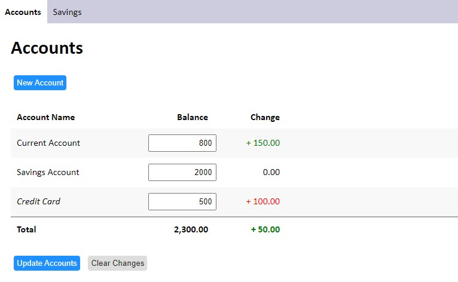
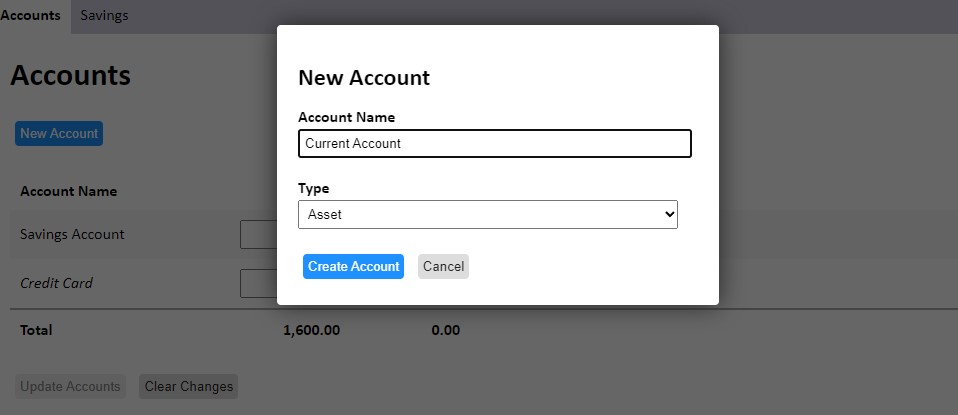
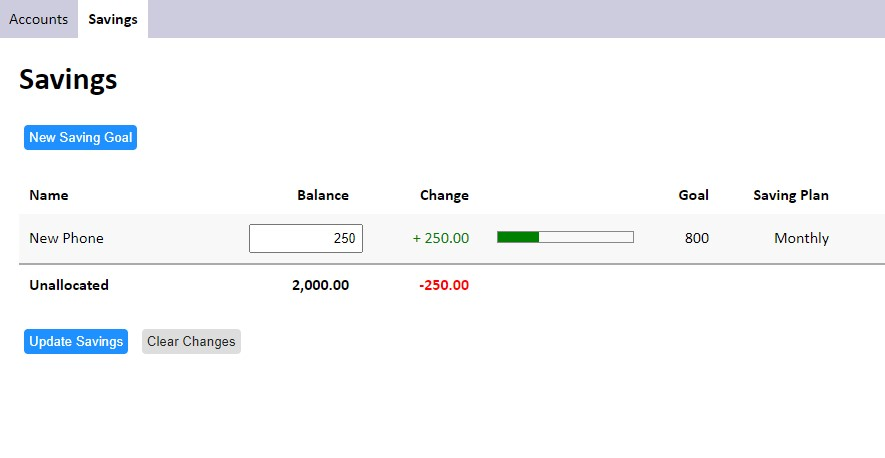
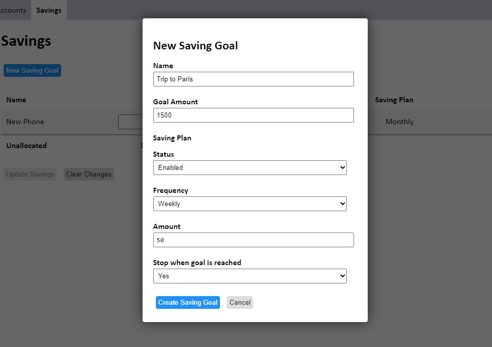

# Sovereign: Personal Savings Management Tool
## About
Sovereign is a personal finance tool written in HTML, CSS and JavaScript using [Neutralino.JS](https://github.com/neutralinojs/neutralinojs) to provide a native desktop experience.
It offers the user the ability to maintain a balance sheet of their financial account(s) and allocate funding towards various saving goals. Adding funds to a goal can be done either on an ad hoc basis or by setting up a saving plan to increase the amount on a regular schedule.

## Background
Some banking apps have in recent years offerred the ability to create sub-accounts or "spaces" to allow their customers to organise their finances in ways which would previously have meant setting up multiple bank accounts and incurring significant administrative effort. However, these features are usually only available for low-interest current accounts and a decision to switch bank accounts would mean recreating the sub-accounts with the new institution (assuming they provide such a feature).  Sovereign therefore aims to separate the task of organising the intended use for funds from where you decide to keep them.

## Installation

**Desktop Version**

The desktop edition of Sovereign is recommended for general use and can be downloaded [here](https://github.com/benwilliams4/Sovereign/releases/tag/v0.1). The application is portable and does not require any installation.

**Web Server**

Copy the source code to the public directory of the server and navigate to index.html. You may need to edit the configuration file (`js/config.js`) for your needs.

## Usage

### Accounts Tab
Use this tab to keep a record of what bank accounts you have and their balance. Make sure to click 'Update Accounts' whenever you wish to save the changes made to the balances.

#### Creating an account
When creating an account you will be prompted to provide a 'name' and 'type' for the account.
The 'type' field allows you to specify whether the account is an asset or a liability. Selecting liability means the balance of the account will count negatively towards your total account balance thus reducing the amount you can allocate to saving goals. This can be useful if you wish to track a credit card balance.

### Savings Tab
Use this tab to allocate funds from your accounts towards specific goals. Make sure to click 'Update Savings' whenever you wish to save any manual changes made to the balances. Adjustments made by saving plans are saved automatically.

#### Creating a saving goal
When creating a saving goal you will be prompted to provide a 'name' and 'goal amount', you will also be given the option to set up a saving plan.

##### Creating a saving plan
You can create a saving plan to increase the balance of the goal by a defined amount on a daily, weekly or monthly basis. If 'Stop when goal is reached' is set, then no funds will be added which take the balance above the goal amount specified.

###### Using variables and expressions to define the saving plan amount
Instead of defining how much the saving plan will increment the goal by as a numeric value, expressions can be used to dynamically calculate this.

**Examples**

Increment by 10% of the goal amount:

`%goal * 0.1` 

If there are more than 1000 in unallocated funds increment by 50, otherwise increment by 10:

`(%unallocated > 1000) ? 50 : 10`

**Supported variables**

`%goal` - The goal amount

`%balance` or `%current` - The current balance of the goal

`%remaining` - The goal amount less the current balance

`%unallocated` - The amount of funds not allocated to any goal

**Supported Arithmetic & Functions**

This feature is implemented with the Math.js Library, please check the [syntax page](https://mathjs.org/docs/expressions/syntax.html) for details on constructing expressions

## Future Development
Sovereign is in early development hence the narrow scope of features currently availalble. Several stories have however been identified for consideration in future releases:

**Additional Features**
- Tabular history of changes to account/saving balances
- Line graph showing account/saving balances over time
- Ability to quickly increase/decrease all saving goal balances by a percentage value
- Automatic retrieval of account balances with Open Banking API

**Enhancements to existing features**
- Settings option to change the day of the week which weekly saving plans are run
- Settings option to change day of the month which monthly saving plans are run
- Ability to define custom variables for use in saving plan amount fields. (e.g. %salary)
- Warning dialogue when saving plan fails due to insufficient unallocated funds
- Settings option to define whether saving plans should run if there are insufficient unallocated funds
- Allow the user to adjust saving balances by providing a +/- change amount
- Option to display a confirmation dialogue before account/saving goal deletion

**Visual Appearance**

- Settings option to change between light and dark themes
- Animate changes to saving goal progress bars

**Documentation**

- Built-in documentation for Math.js formulas
